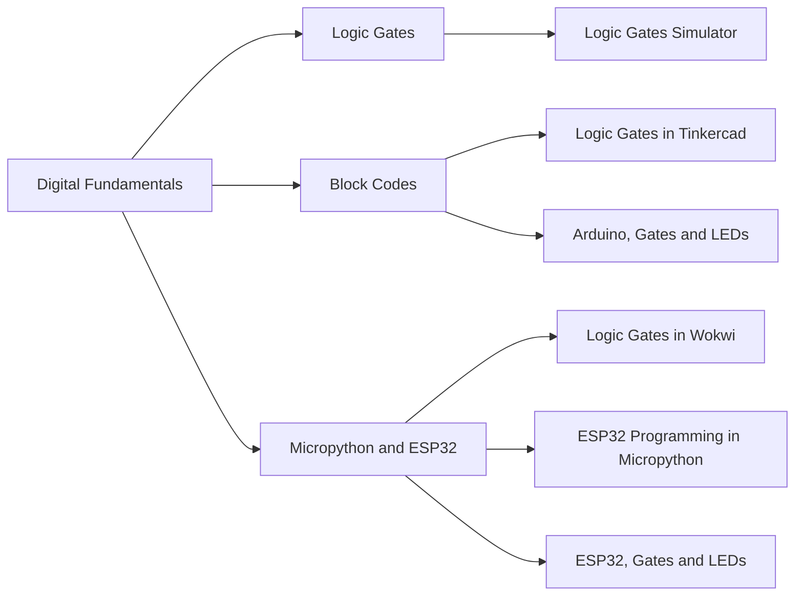

# Digital Fundamentals



## Topic1: Logic Gates
[Logic Gate Simulator](https://academo.org/demos/logic-gate-simulator/)

## Topic2: Logic Circuits & Block Codes
[74HC Series ICs](https://www.build-electronic-circuits.com/7400-series-integrated-circuits/)  
[TinkerCAD](https://www.tinkercad.com/)(need to sign in)

## Topic3: LED_ON by MicroPython
[esp32 docs](https://docs.micropython.org/en/latest/esp32/quickref.html)  
[MicroPython Simulator](https://wokwi.com/micropython)(need to sign in)  
  


>Readings  
```pdf
ed/L01/LED_ON.pdf
```