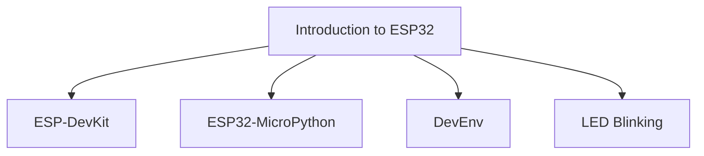
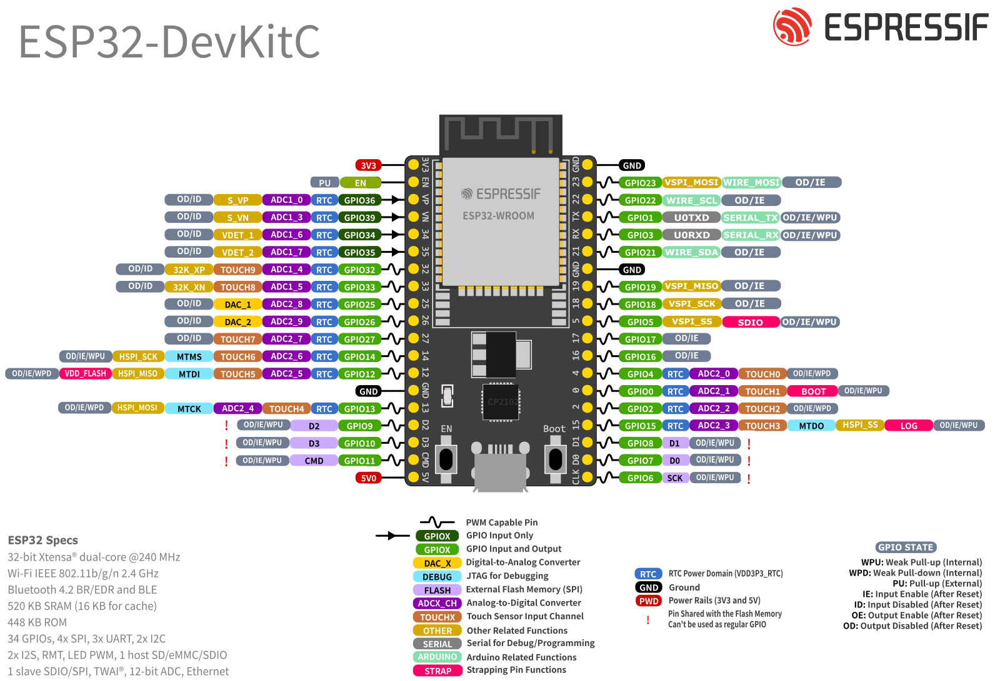

# Introduction to ESP32





## Topic1: ESP32-DevKitC
[user guide](https://docs.espressif.com/projects/esp-dev-kits/en/latest/esp32/esp32-devkitc/user_guide.html)  

## Topic2: ESP32-MicroPython
[docs](https://docs.micropython.org/en/latest/esp32/quickref.html)  

## Topic3: DevEnv
[WOKWI](https://wokwi.com/micropython)(need to sign in)  
  
## Topic4: LED Blinking

>Read the textbook  
```pdf
ed/L02/LED_ON.pdf
```