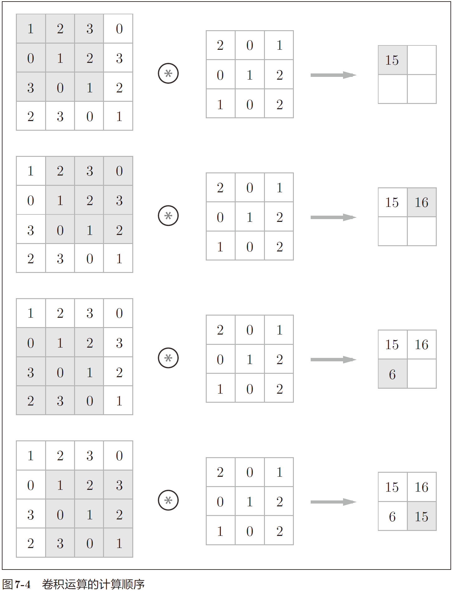
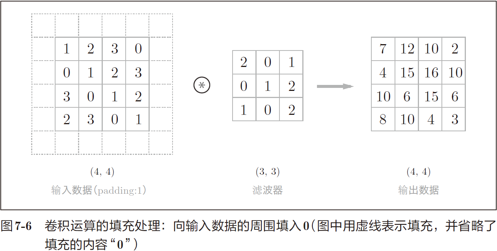

# 鱼书摘要之五
  
图像是3维形状，这个形状中应该含有重要的空间信息。比如，空间上邻近的像素为相似的值、RBG的各个通道之间分别有密切的关联性、相距较远的像素之间没有什么关联等，3维形状中可能隐藏有值得提取的本质模式。但是，因为`全连接层会忽视形状`，将全部的输入数据作为相同的神经元（同一维度的神经元）处理，所以无法利用与形状相关的信息。而`卷积层可以保持形状不变`。当输入数据是图像时，卷积层会以3维数据的形式接收输入数据，并同样以3维数据的形式输出至下一层。因此，在CNN中，可以（有可能）正确理解图像等具有形状的数据。  
  
  
$\Uparrow$滤波器可类比全连接层的权重，也叫`核`  

$\Uparrow$填充可使得输入输出维度一致  

步幅加进来一起考虑，则有如下公式：`H`eight, `W`idth, `F`ilter, `P`adding, `S`tride  
$OH=\frac{H+2P-FH}S+1\\OW=\frac{W+2P-FW}S+1$  

  
$\Uparrow$对3个通道分别计算出的卷积结果求和（先按通道分别进行输入数据和滤波器的卷积，然后求和）  

  
$\Uparrow$如同全连接层，不同的神经元有不同的权重，卷积层不同权重体现在通道方向上FN个滤波器（组）；偏置的实现直接利用numpy的广播功能。  

>池化层用于降维；池化窗口维度与步幅一致；通道数不变（按通道数池化）；微小位置的变化具有鲁棒性