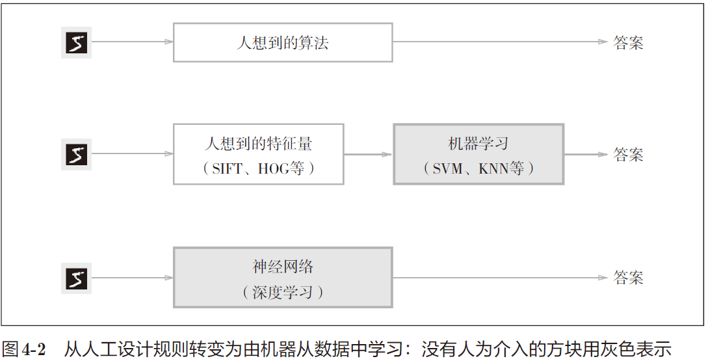

# 鱼书摘记之二
>深度学习有时也称为端到端机器学习（end-to-end machine learning）

  
深度学习不需要人来设计特征量的提取方法  
  
机器学习中，一般将数据分为训练数据和测试数据两部分来进行学习和实验等。首先，使用训练数据进行学习，寻找最优的参数；然后，使用测试数据评价训练得到的模型的实际能力。为什么需要将数据分为训练数据和测试数据呢？因为我们追求的是模型的泛化能力。为了正确评价模型的泛化能力，就必须划分训练数据和测试数据。另外，训练数据也可以称为监督数据。  
如果遇到大数据，数据量会有几百万、几千万之多，这种情况下以全部数据为对象计算损失函数是不现实的。因此，我们从全部数据中选出一部分，作为全部数据的“近似”。神经网络的学习也是从训练数据中选出一批数据（称为mini-batch, 小批量），然后对每个mini-batch 进行学习。  
>batch_mask = np.random.choice(train_size, batch_size)

识别精度对微小的参数变化基本上没有什么反应，即便有反应，它的值也是不连续地、突然地变化。所以使用损失函数作为评价参数调整方向是否有效的指标，因为损失函数导数不为0，精度导数经常为0。  
  
像
$\left(\frac{\partial f}{\partial x_0},\frac{\partial f}{\partial x_1}\right)$
这样的由全部变量的偏导数汇总而成的向量称为梯度（gradient）。  
在梯度法中，函数的取值从当前位置沿着梯度方向前进一定距离，然后在新的地方重新求梯度，再沿着新梯度方向前进，如此反复，不断地沿梯度方向前进。像这样，通过不断地沿梯度方向前进，逐渐减小函数值的过程就是梯度法（gradient method）。梯度法是解决机器学习中最优化问题的常用方法，特别是在神经网络的学习中经常被使用。  
用数学公式（4.7）表示梯度法  
>$\left\{\begin{array}{l}x_0=x_0-\eta\frac{\partial f}{\partial x_0}\\x_1=x_1-\eta\frac{\partial f}{\partial x_1}\end{array}\begin{array}{ccc}&&\end{array}\right.(4.7)$

η表示更新量，在神经网络的学习中，称为学习率（learning rate）。学习率决定在一次学习中，应该学习多少，以及在多大程度上更新参数。式（4.7）是表示更新一次的式子，这个步骤会反复执行。也就是说，每一步都按式（4.7）更新变量的值，通过反复执行此步骤，逐渐减小函数值。  
学习率过大的话，会发散成一个很大的值；反过来，学习率过小的话，基本上没怎么更新就结束了（陷入局部最优无法跨越）。也就是说，设定合适的学习率是一个很重要的问题。
>极小值——局部最小，最小值——全局最小

>像学习率这样的参数称为超参数。这是一种和神经网络的参数（权重和偏置）性质不同的参数。相对于神经网络的权重参数是通过训练数据和学习算法自动获得的，学习率这样的超参数则是人工设定的。一般来说，超参数需要尝试多个值，以便找到一种可以使学习顺利进行的设定。  

神经网络的学习也要求梯度。这里所说的梯度是指损失函数关于权重参数的梯度  
>$W=\begin{pmatrix}\begin{array}{ccc}\omega_{11}&\omega_{12}&\omega_{13}\end{array}\\\begin{array}{ccc}\omega_{21}&\omega_{22}&\omega_{23}\end{array}\end{pmatrix}$  
$\frac{\partial L}{\partial W}=\begin{pmatrix}\begin{array}{ccc}\frac{\partial L}{\partial\omega_{11}}&\frac{\partial L}{\partial\omega_{12}}&\frac{\partial L}{\partial\omega_{13}}\end{array}\\\begin{array}{ccc}\frac{\partial L}{\partial\omega_{21}}&\frac{\partial L}{\partial\omega_{22}}&\frac{\partial L}{\partial\omega_{23}}\end{array}\end{pmatrix}$ 

总结神经网络的学习步骤  
前提  
神经网络存在合适的权重和偏置，调整权重和偏置以便拟合训练数据的过程称为“学习”。神经网络的学习分成下面4 个步骤。  
步骤1（mini-batch）  
从训练数据中随机选出一部分数据，这部分数据称为mini-batch。我们的目标是减小mini-batch 的损失函数的值。  
步骤2（计算梯度）  
为了减小mini-batch 的损失函数的值，需要求出各个权重参数的梯度。梯度表示损失函数的值减小最多的方向。  
步骤3（更新参数）  
将权重参数沿梯度方向进行微小更新。  
步骤4（重复）  
重复步骤1、步骤2、步骤3。  

